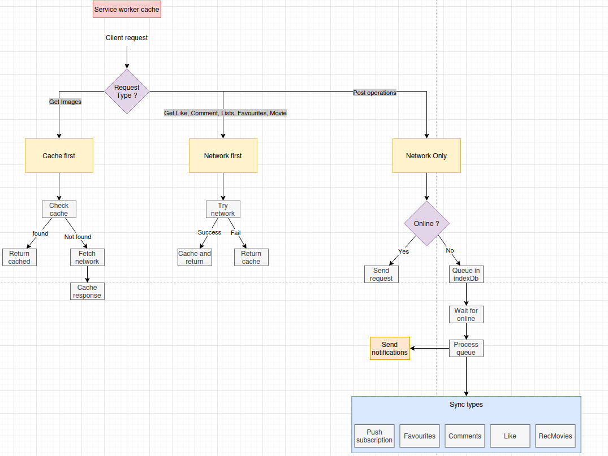
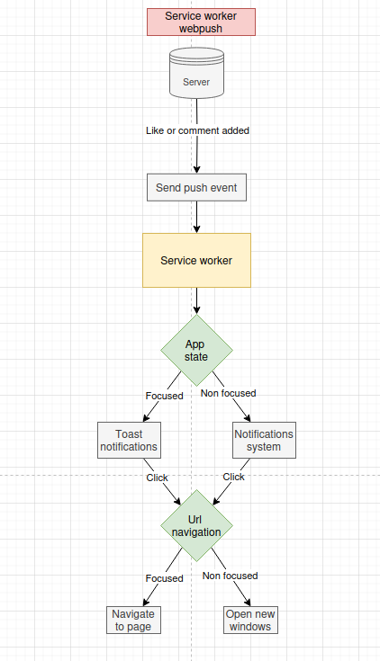
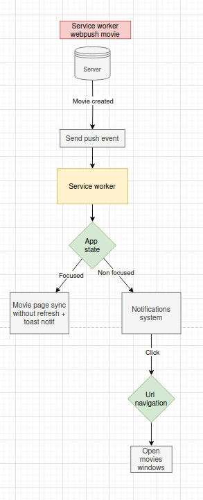

# PWA Documentation

## Core Components

### Manifest
- Generated by vite-pwa plugin during build
- Configuration location: `/frontend/vite.config.js`

### Service Worker

#### Setup
- Utilizes useRegisterSW from vite-pwa
- Implementation: `/frontend/src/components/feedback/OfflineAlert.jsx`

#### Auto-Update System
- Location: `/frontend/src/components/feedback/OfflineAlert.jsx`
- Features:
  - New service worker detection
  - User prompt for updates
  - Automatic refresh after update acceptance

#### Offline Experience
- Offline state detection
- User notification system
- Offline message display

### Caching System

#### Cache Strategies

1. CacheFirst
   - Primary cache retrieval
   - Network fallback
   - Optimized for static resources

2. NetworkFirst
   - Primary network retrieval
   - Cache fallback
   - Ensures data freshness

3. NetworkOnly
   - Exclusive network requests
   - No caching mechanism

#### API Endpoints and Strategies

##### GET Requests

| Endpoint | Strategy | Rationale |
|----------|----------|-----------|
| `/api/movies` | NetworkFirst | - Need latest content - Light payload - Admin can create image |
| `/api/movies/:movieId/image` | CacheFirst | - Heavy resources - Performance optimization - Static content |
| `/api/favourites` | NetworkFirst | - User-specific data - Requires freshness - Cache fallback |
| `/api/lists` | NetworkFirst | - Dynamic content - Requires latest data |
| `/api/like` | NetworkFirst | - User interaction state - Accuracy required |
| `/api/comment` | NetworkFirst | - User-generated content - Accuracy required |

##### POST Requests
All POST requests use BackgroundSyncPlugin for offline handling:
- IndexDB storage during offline state
- Automatic sync when online
- Front-end result notification

| Endpoint | Strategy |
|----------|----------|
| `/api/push-subscription` | NetworkOnly |
| `/api/favourites` | NetworkOnly |
| `/api/comment` | NetworkOnly |
| `/api/lists` | NetworkOnly |
| `/api/like` | NetworkOnly |

##### DELETE Requests
- Currently not implemented
- Future development area

##### Cache diagram 

### Push Notifications
- Complete implementation
- Features:
  - Focus detection for notification type
  - In-app toast for focused windows
  - System notifications for background state
  - Custom icon and badge: `/pwa-192x192.png`
  - Vibration pattern: [200, 100, 200]
  - Automatic window focusing on click
  - New window creation if needed

| Method | Endpoint | Notification push when ... |
|----------|----------|-------------------|
| POST | `/api/like/:recListId` | Owner of a recommendation list get a like on one of his recommendation list
| POST | `/api/comment/:recListId` | Owner of a recommendation list get a comment on one of his recommendation list
| POST | `/api/movie` | Admin create a movie and all users got a notifications

#### Diagram push notifications
`/api/like/:recListId` && `/api/comment/:recListId`

`/api/movie`

## Technical Dependencies
- vite-pwa plugin
- Workbox
- IndexDB
- Service Worker API